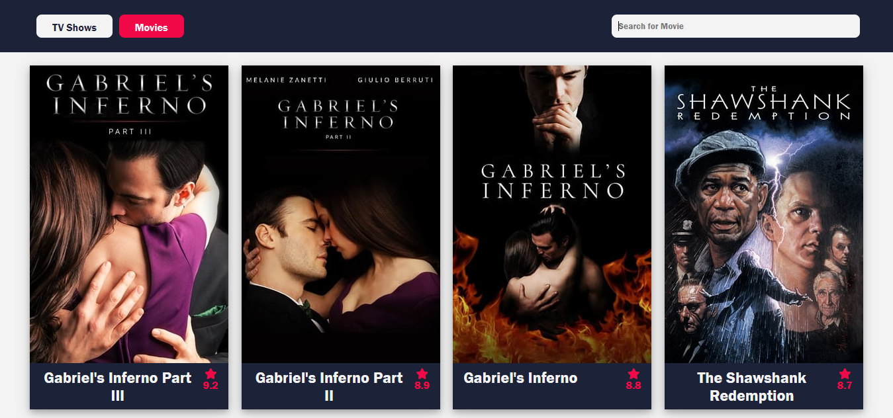
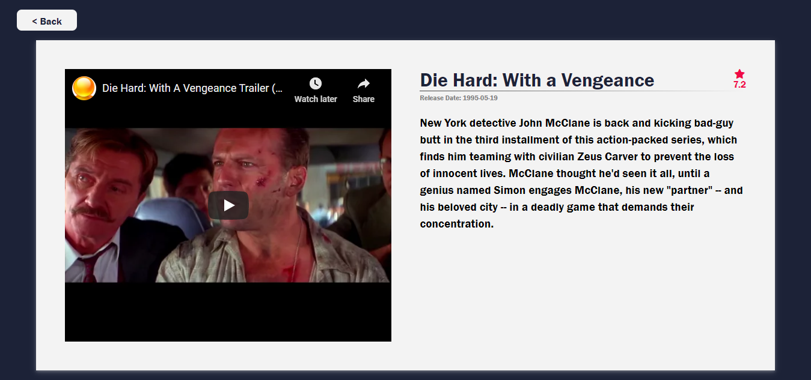

# Movies and TV Shows

Movies and TV Shows app illustrating Web development best practices using React and Typescript.
[Live Demo](https://movies-and-tv-shows.netlify.app/)

## Introduction

The app have functionalities of displaying the top 10 rated TV shows and the top 10 movies, a search function for both, and a detail view for individual items.




### Getting Started

1. Clone or download this repository.
2. Create an account on [TheMovieDB API](https://developers.themoviedb.org/3/) and generate your API key following these [instructions](https://developers.themoviedb.org/3/getting-started/introduction).
3. In root folder of the project create `.env` file and inside it write:

```
REACT_APP_MOVIES_API_KEY=<your API key from The MovieDB API you created in step 2>
```

4. Open a terminal, type "npm install", wait for installation process and then type "npm start".
5. Open http://localhost:3000 to view it in the browser.

### Technical Requirements

- React
  - React Router - Using client-side routing to create a single page application
  - React Context - Working with global state (save, modify and consume state)
- Typescript
  - Static type checker. It compiles your React code to type-check your code.
- ESLint
  - For linting/static analysis to have nice and clean code
- Responsive app
  - Propper HTML structure and CSS layout skills (no CSS frameworks)

### App requirements

- When the app loads, the TV SHOWS tab should be selected. Clicking on a tab loads the top 10 MOVIES/TV SHOWS depending on the selected tab.
- The search field should be live and react to any change in the input field.
- The search should fire a request on the search endpoint from TMDB and not filter the top 10 results.
- The search is performed only when there are 3 or more characters in the search bar and it should be triggered only 1 second after the user has stopped typing.
- When there are less than 3 characters in the search bar, the content should revert back to the top 10 MOVIES/TV SHOWS.
- Switching between tabs while searching should trigger the search again with the same search term for the selected tab and update the results.
- When the user clicks on a specific MOVIE/TV SHOW, he is taken to the details view.
- The Detailed View of the Movie/TV Show should show the cover image on top and in case of Movies/TV Shows which have a trailer should show the trailer video instead of the cover image. Below the image/trailer some basic information regarding the selected Movie/TV Show should be shown.
- The Back Button should return the user back to where he was and with the same state before clicking to see more information about a Movie/TV Show. (Meaning that the correct tab should be selected and if the user came from search - the search result with the search term should be there).
